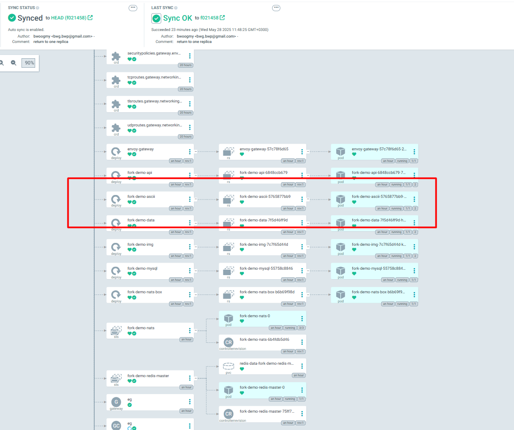
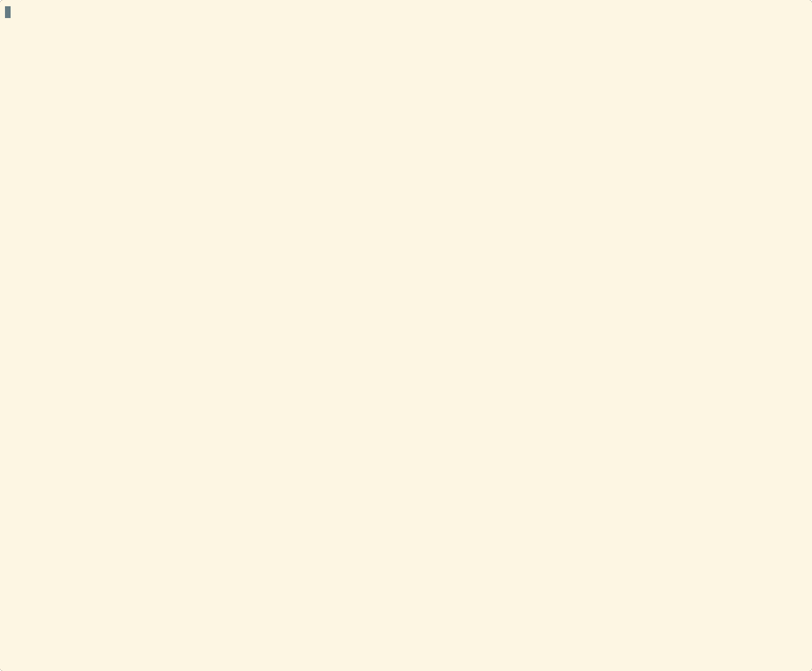

# MVP демо — AsciiArtify + ArgoCD

Це демо показує, як AsciiArtify автоматично деплоїться та оновлюється в Kubernetes-кластері через ArgoCD із Git-репозиторію. Після кожної зміни в репі (наприклад, кількості реплік) ArgoCD автоматично підхоплює зміни, застосовує їх, а додаток залишається доступним для користувачів.

---

## 1. Стартове розгортання

- ArgoCD розгорнутий у кластері.
- Додаток AsciiArtify підключений як ArgoCD Application із GitHub-репозиторію.
- Усі ресурси в статусі **Synced / Healthy** (див. скрін):


---

## 2. Жива демонстрація оновлення через Git

- Міняємо кількість реплік у файлі `values.yaml` (наприклад, `ascii.replicas: 1` → `2`).
- Робимо commit і push у master-гілку.
- ArgoCD бачить зміни і автоматично оновлює додаток у кластері.

**GIF/скрін процесу:**




---

### Перевірка змін до і після:

```bash
kubectl get deployment fork-demo-ascii -n fork-demo
# До: 1/1
# Після: 2/2
```

## 3. Перевірка API

- Через port-forward або зовнішній сервіс перевіряємо, що додаток працює і відповідає на запити:

```bash
curl -F 'file=@/tmp/test.png' http://localhost:8082/api/ascii
```

- API працює, повертає ascii-арт із зображення (див. gif пункт 5):

## 4. Висновок

- ArgoCD забезпечує повністю автоматизоване оновлення додатку за змінами у Git.

- Демонстрація показує робочий цикл CI/CD для Kubernetes через ArgoCD.

## 5. Відео/гіфка демо

Нижче можна побачити коротку гіфку, яка демонструє повний цикл роботи AsciiArtify з автоматичним оновленням через ArgoCD:


