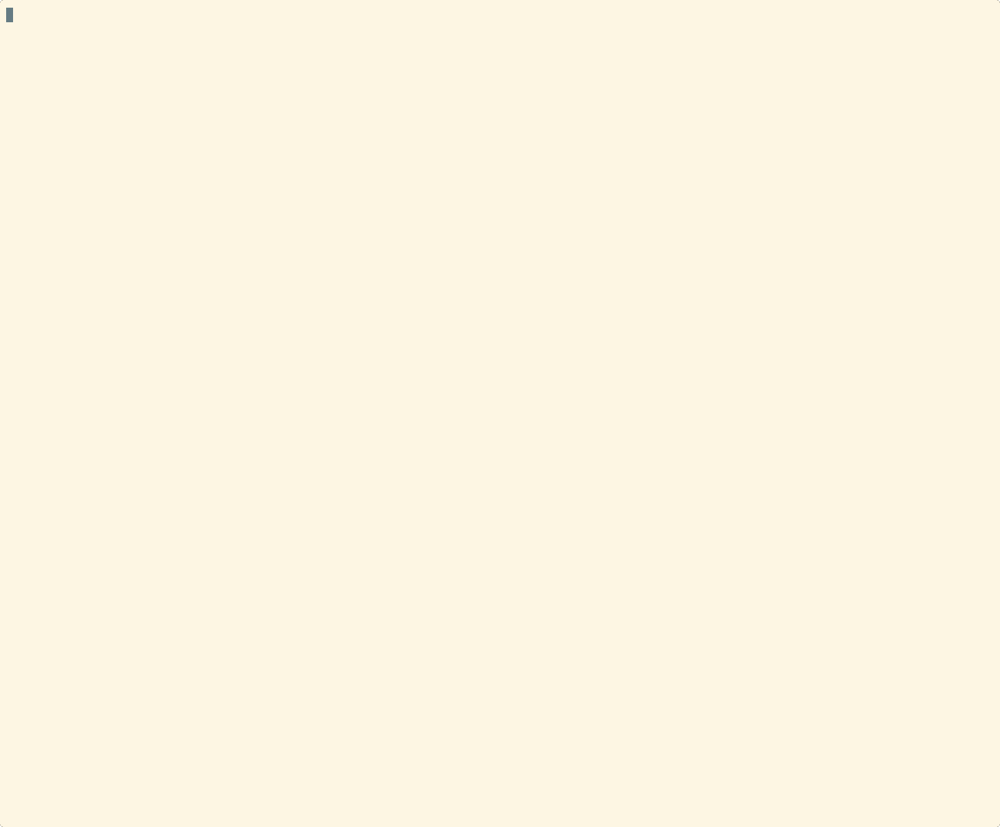

# Proof of Concept: Розгортання ArgoCD у кластері k3d для AsciiArtify

## Вступ
На цьому етапі команда AsciiArtify реалізує PoC — впровадження GitOps-системи ArgoCD у локальному Kubernetes-кластері на основі k3d. Це дозволяє автоматизувати CI/CD та спростити контроль версій у проєкті.

---

## Кроки по розгортанню ArgoCD

### 1. Створення Kubernetes-кластера k3d
```bash
k3d cluster create k3d-asciiartify
```

Перевірити статус вузлів:
```bash
kubectl get nodes
```

### 2. Створення namespace для ArgoCD
```bash
kubectl create namespace argocd
```

### 3. Встановлення ArgoCD
```bash
kubectl apply -n argocd -f https://raw.githubusercontent.com/argoproj/argo-cd/stable/manifests/install.yaml
```

Перевірити статус подів:
```bash
kubectl get pods -n argocd
```

### 4. Отримати пароль адміністратора
```bash
kubectl get secret argocd-initial-admin-secret -n argocd -o jsonpath="{.data.password}" | base64 -d && echo
```

> **Важливо:** Збережіть цей пароль — він потрібен для першого входу в ArgoCD.

### 5. Проброс порту для доступу до ArgoCD
```bash
kubectl port-forward svc/argocd-server -n argocd 8080:443
```

Команда лишає порт відкритим на localhost сервера.

### 6. Доступ до інтерфейсу ArgoCD

1. Відкрийте браузер та перейдіть за адресою:
   ```
   https://localhost:8080
   ```

2. Якщо сервер віддалений — створіть SSH-тунель (наприклад, через Termius або таку команду):
   ```bash
   ssh -L 8080:localhost:8080 <користувач>@<IP_сервера>
   ```

3. Введіть облікові дані:
   - **Username:** admin
   - **Password:** (пароль з кроку 4)

### 7. Демонстрація



---

## Висновки

ArgoCD успішно розгорнуто у кластері k3d та готовий до подальшого використання для впровадження GitOps у проєкті AsciiArtify.

---

## Додатково: Поширені проблеми

### Проблема з портом
Якщо порт 8080 зайнятий — використовуйте інший порт:
```bash
kubectl port-forward svc/argocd-server -n argocd 8081:443
```

### Проблема з ресурсами
Якщо поди у статусі Pending — перевірте ресурси Docker/кластеру:
```bash
kubectl describe pods -n argocd
```

### Повне видалення
Для повного видалення ArgoCD та кластера:
```bash
kubectl delete namespace argocd
k3d cluster delete k3d-asciiartify
```

### Додаткові команди для налагодження
```bash
# Перевірити всі ресурси в namespace argocd
kubectl get all -n argocd

# Переглянути логи ArgoCD сервера
kubectl logs -n argocd deployment/argocd-server

# Перевірити статус кластера
kubectl cluster-info
```