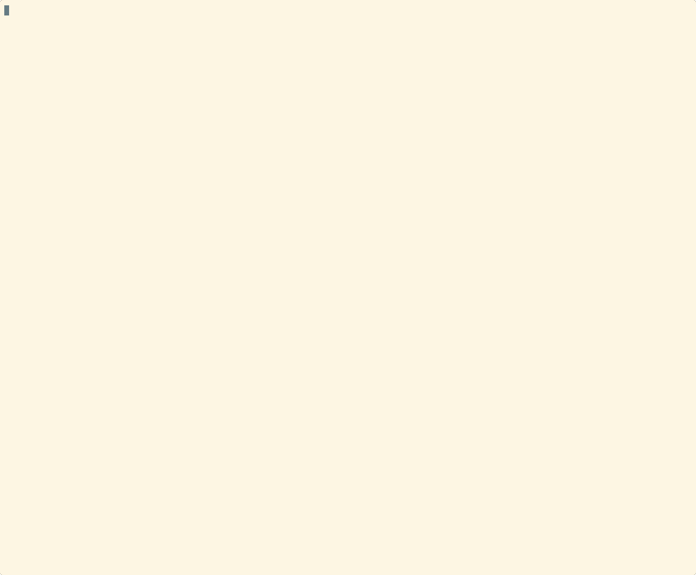

# Kubectl Plugin: vstat

**`vstat`** is a custom kubectl plugin for quickly viewing the current CPU and memory usage of all pods in a specified Kubernetes namespace.  
It is a lightweight, portable Bash script that integrates seamlessly with `kubectl` as a plugin.

---

## Features

- Shows a formatted table of pod resource usage (CPU and Memory)
- Namespace selection (with default)
- Simple, human-readable output
- Works everywhere kubectl does (no extra dependencies except metrics-server)

---

## Prerequisites

- [kubectl](https://kubernetes.io/docs/tasks/tools/) must be installed and configured to interact with your cluster.
- [Metrics Server](https://github.com/kubernetes-sigs/metrics-server) must be installed and running in your cluster.

You can install the Metrics Server with:
```bash
kubectl apply -f https://github.com/kubernetes-sigs/metrics-server/releases/latest/download/components.yaml
```

# kubectl vstat Plugin Documentation

## Usage

You can run the plugin using:

```bash
kubectl vstat [namespace]
```

* If you do not specify a namespace, it defaults to `kube-system`.

## Examples

```bash
kubectl vstat
kubectl vstat default
kubectl vstat fork-demo
```

## Output Example

```
Resource, Namespace, Name, CPU, Memory
Pod, fork-demo, fork-demo-api-6848ccb679-7klpl, 2m, 50Mi
Pod, fork-demo, fork-demo-nats-0, 3m, 10Mi
Pod, fork-demo, fork-demo-redis-master-0, 1m, 20Mi
...
```

## Demo



*This demo shows how to use the plugin and the output format.*


## Troubleshooting

* If you see errors like `Unable to retrieve metrics`, make sure Metrics Server is running in your cluster.
* To check pods in all namespaces, run `kubectl get pods -A`.

## How It Works

> This plugin is a small wrapper around `kubectl top pods -n <namespace>`. It fetches real-time resource usage for all pods in the specified namespace and outputs a table with columns: Resource, Namespace, Name, CPU, and Memory.